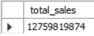

# Samsung Sales 2023 Data Analysis

## Project Overview:

The Samsung Sales Data Analysis 2023 project explores Samsung's sales data using SQL to uncover valuable business insights. The analysis focuses on evaluating product performance, revenue generation, and sales trends across different time periods and price ranges. Key objectives include identifying top-selling products, determining sales patterns by month and quarter, and analyzing price range performance. This project aims to provide actionable insights for improving sales strategies and optimizing product offerings.

## Project Objectives:

###  Product Insights:

- Count the total number of unique products sold.

- Identify the top 5 highest-selling products by total sales.

- Determine the product with the highest total revenue.

- Find the most sold product (in units) for the year 2023.

### Revenue Analysis:

- Calculate the total revenue generated for all products.

- Analyze sales performance by price range.

- Compute revenue for specific periods (e.g., Q1 2023 and first half of 2023).

- Find the total revenue from the top 3 most sold products.

### Sales Trends:

- Track quarterly sales trends for 2023.

- Identify which month had the highest total sales in 2023.

- Determine how many products were sold each month in 2023.

- Analyze total quantity sold for each product by release year.
  
# Tools & Library Used
MySQL

[Datasets Used](https://www.kaggle.com/datasets/firmanhermawan/data-sales-report-samsung-2023?select=samsung_product_data.csv)

[SQL Analysis (Code)](https://github.com/tanu4419/Samsung_Sales_2023/blob/main/Samsung_Sales_Analysis.sql)

# Query Task

1. Count the total number of unique products sold.

 &nbsp;

2. Find the top 5 highest-selling products by total sales.

 &nbsp;

3. Calculate the total revenue generated for all products.

 &nbsp;

4. Find the product with the highest total revenue.

 &nbsp;

5. Find all transactions that occurred in October 2023.

 &nbsp;

6. Find the average price of products sold.

 &nbsp;

7. Sales in a Specific Period (e.g., Q1 2023) 

 &nbsp;

8. Most Sold Product (Units) in 2023 

 &nbsp;

9. Sales Performance by Price Range 

 &nbsp;

10. Quarterly Sales Trend in 2023 

 &nbsp;

11. Which month had the highest total sales in 2023? 

 &nbsp;

12. What was the total sales revenue for the first half of 2023 (Jan-Jun)? 

 &nbsp;

13 How many products were sold each month in 2023? 

 &nbsp;

14 What is the price range for the products sold? 

 &nbsp;

15. How many products were sold with a price above the average price? 

 &nbsp;

16. How many products were sold in each quarter?
    
 &nbsp;

18. What was the total revenue from the top 3 most sold products?

 &nbsp;

18. Which product had the largest price drop between the first and last sale? 

 &nbsp;

19. How many products were sold during weekends (Saturday and Sunday)?
    
 &nbsp;

20. What is the total quantity sold for each product, grouped by product name and release year?

 &nbsp;

21. Count the total number of transactions for each product?

 &nbsp;

22. List all products that have not been sold (no matching records in sales data)?

 &nbsp;

24. List all products released in 2023?

 &nbsp;

24. Find the most recent transaction date for each product?
    
 &nbsp;

26. Find the total quantity sold for each product?
    
 &nbsp;

28. Find the total sales for each product?

 &nbsp;

27. Retrieve details of a sample of products (top 5 by release year)?

 &nbsp;

## Project Objectives:
This analysis provides actionable insights to enhance Samsung's sales strategies, optimize inventory management, and identify key revenue drivers. By understanding product performance and sales trends, the business can make informed decisions to improve profitability and customer satisfaction.

